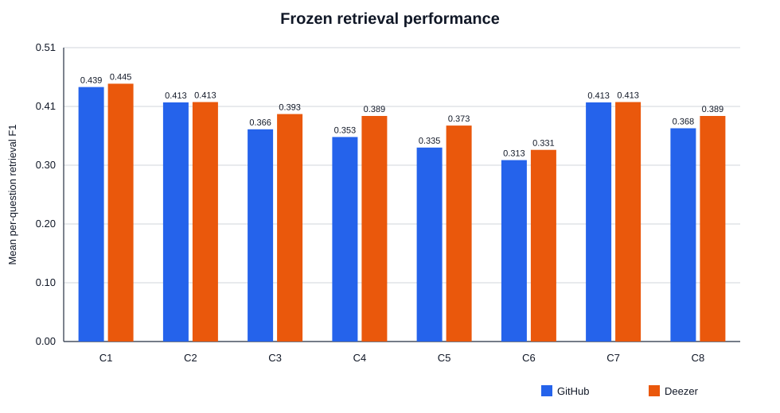
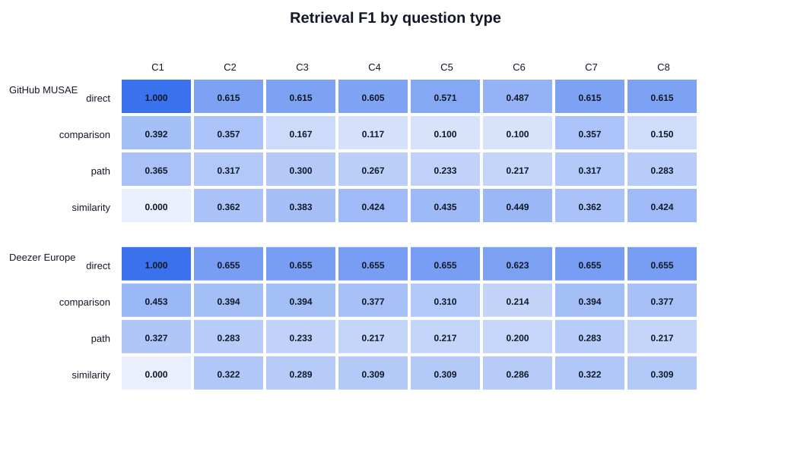
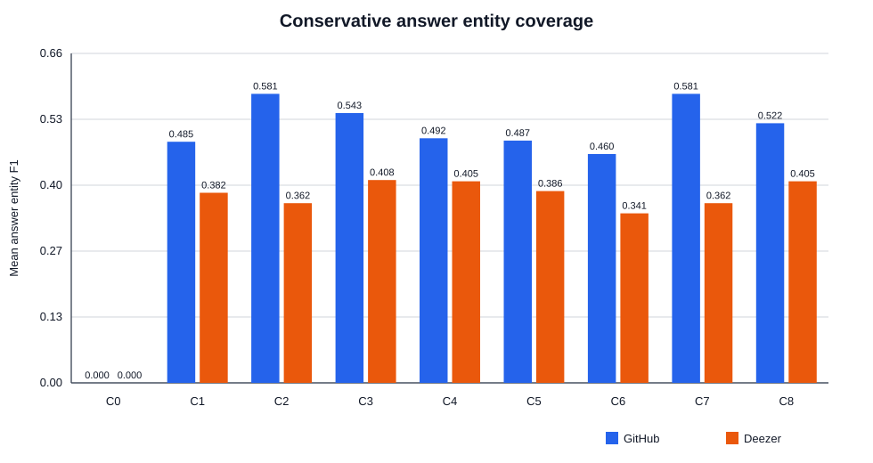

# Results and Discussion

## 1. Experimental scope

This chapter reports the frozen cross-dataset evaluation of query-adaptive
approximate graph propagation (AGP). The experiment asks whether selecting AGP
parameters separately for each natural-language question improves graph evidence
retrieval and downstream answer generation compared with simpler baselines.

The study uses two previously untouched evaluation sets derived from real social
graphs:

- **GitHub MUSAE:** 37,700 nodes and 289,003 undirected edges;
- **Deezer Europe:** 28,281 nodes and 92,752 undirected edges.

Each evaluation set contains 40 questions: ten direct-neighbour questions, ten
common-neighbour comparisons, ten connection-chain questions, and ten similarity
questions requiring a same-class node reached through one intermediate node.
Development and evaluation seed nodes are disjoint. Labels were calculated from
graph topology before any AGP or LLM output was produced.

The experiment compares nine conditions:

| Condition | Method |
| --- | --- |
| C0 | Local LLM without graph context |
| C1 | Direct-neighbour retrieval |
| C2 | Native AGP with `(a,b)=(0,1)` |
| C3 | Native AGP with `(a,b)=(0.25,0.75)` |
| C4 | Native AGP with `(a,b)=(0.5,0.5)` |
| C5 | Native AGP with `(a,b)=(0.75,0.25)` |
| C6 | Native AGP with `(a,b)=(1,0)` |
| C7 | Frozen wording-rule selector choosing C2–C6 |
| C8 | Frozen zero-shot LLM selector choosing C2–C6 from the question alone |

All graph-backed conditions use native AGP-Static++ where applicable, depth 2,
decay 0.3, a ten-node ranking budget, query type `S`, and relative error 0.1.
Keyword-to-node mapping uses a similarity threshold of 0.85 and an ambiguity
margin of 0.10. Answers use local
`qwen3:4b-instruct-2507-q4_K_M`, temperature zero, and a shared 256-token output
ceiling. C7 and C8 reuse the answer generated for their chosen fixed arm.

The complete protocol was checksum-locked before evaluation. All intended seed
sets were mapped exactly: 40/40 on GitHub and 40/40 on Deezer. Consequently,
differences in the final experiment cannot be attributed to seed-mapping errors.

## 2. Overall retrieval results

Table 1 reports mean per-question retrieval F1. C0 is omitted because it has no
retrieved graph context.

**Table 1. Frozen held-out retrieval F1.**

| Condition | GitHub | Deezer |
| --- | ---: | ---: |
| C1 direct neighbours | **0.4394** | **0.4450** |
| C2 AGP `(0,1)` | 0.4129 | 0.4134 |
| C3 AGP `(.25,.75)` | 0.3664 | 0.3927 |
| C4 AGP `(.5,.5)` | 0.3530 | 0.3895 |
| C5 AGP `(.75,.25)` | 0.3348 | 0.3728 |
| C6 AGP `(1,0)` | 0.3132 | 0.3308 |
| C7 rule selector | 0.4129 | 0.4134 |
| C8 LLM selector | 0.3682 | 0.3895 |

C1 achieves the highest aggregate F1 on both graphs. The differences relative
to C2 are modest: +0.0265 on GitHub and +0.0316 on Deezer. Paired bootstrap
intervals based on 10,000 deterministic resamples cross zero on both datasets:
`[-0.0672, 0.1208]` and `[-0.0561, 0.1199]`, respectively. The experiment
therefore does not establish a clear paired difference between C1 and C2 at the
95% bootstrap level.

Among the five fixed AGP configurations, C2 is strongest on both datasets.
Increasing `a` while decreasing `b` generally lowers aggregate F1. This overall
trend does not imply that C2 is optimal for every question, as the question-type
analysis below demonstrates.

## 3. Results by question type

The aggregate result is strongly influenced by the balanced composition of the
benchmark. Direct-neighbour questions form one quarter of each evaluation set,
and C1 is constructed specifically for that task. Table 2 shows selected arms
that illustrate the trade-off.

**Table 2. Retrieval F1 by question type.**

| Dataset | Type | C1 | C2 | C6 | C8 |
| --- | --- | ---: | ---: | ---: | ---: |
| GitHub | Direct | **1.000** | 0.615 | 0.487 | 0.615 |
| GitHub | Comparison | **0.392** | 0.357 | 0.100 | 0.150 |
| GitHub | Connection chain | **0.365** | 0.317 | 0.217 | 0.283 |
| GitHub | Similarity | 0.000 | 0.362 | **0.449** | 0.424 |
| Deezer | Direct | **1.000** | 0.655 | 0.623 | 0.655 |
| Deezer | Comparison | **0.453** | 0.394 | 0.214 | 0.377 |
| Deezer | Connection chain | **0.327** | 0.283 | 0.200 | 0.217 |
| Deezer | Similarity | 0.000 | **0.322** | 0.286 | 0.309 |

C1 retrieves every labelled node for direct questions with no irrelevant nodes,
giving F1 1.0 on both datasets. However, it scores zero for every similarity
question because those answers explicitly exclude directly connected nodes.
Propagation is therefore necessary for this question type.

On GitHub similarity questions, performance increases as the pair moves from C2
to C6, reaching 0.449 for C6. The direction differs on Deezer, where C2 is the
strongest of the displayed arms at 0.322. This supports an important but narrower
form of the research motivation: retrieval behaviour depends on both question
type and graph structure. It does not by itself show that the implemented
selectors can predict the best pair.

## 4. Adaptive parameter selection

### 4.1 Rule selector

C7 produces exactly the same result as C2 on every evaluation question. The
frozen selector was developed from Facebook question wording and did not
recognize the new GitHub or Deezer formulations, so it always used its C2
fallback. Its paired difference from C2 is exactly zero with confidence interval
`[0,0]` on both datasets.

This result should not be described as successful adaptation. It demonstrates a
generalization failure of a surface-wording rule system: a selector may appear
adaptive on its development templates while becoming a fixed baseline under new
wording.

### 4.2 Zero-shot LLM selector

On GitHub, C8 selected C3 for 19 questions and C4 for 21. On Deezer it selected
C4 for all 40 questions. It never chose C2, C5, or C6. C8 underperformed C2 by
0.0447 F1 on GitHub and 0.0239 on Deezer. The paired 95% bootstrap intervals are
`[-0.0939, 0.0011]` and `[-0.0521, 0.0012]`. Both narrowly cross zero, so these
results do not establish a non-zero paired difference at the 95% bootstrap
level; they also provide no evidence of an advantage for C8.

The most plausible explanation is an information mismatch. The natural-language
question reveals the requested relation, but not the local degree distribution,
candidate density, or how a particular `(a,b)` pair will rank nodes in the
current graph. A zero-shot LLM can classify wording but cannot directly observe
the graph properties that determine propagation performance.

## 5. Automatic answer results

Table 3 reports conservative entity-title F1. The metric detects exact mentions
of topology-defined reference titles in generated answers.

**Table 3. Automatic answer entity F1.**

| Condition | GitHub | Deezer |
| --- | ---: | ---: |
| C0 LLM only | 0.0000 | 0.0000 |
| C1 direct neighbours | 0.4850 | 0.3824 |
| C2 AGP `(0,1)` | **0.5813** | 0.3615 |
| C3 AGP `(.25,.75)` | 0.5427 | **0.4080** |
| C4 AGP `(.5,.5)` | 0.4919 | 0.4055 |
| C5 AGP `(.75,.25)` | 0.4873 | 0.3859 |
| C6 AGP `(1,0)` | 0.4603 | 0.3410 |
| C7 rule selector | **0.5813** | 0.3615 |
| C8 LLM selector | 0.5224 | 0.4055 |

The answer metric does not reproduce the retrieval ordering exactly. On GitHub,
C2 yields the highest entity F1 even though C1 has higher retrieval F1. On
Deezer, C3 narrowly leads C4 and C8. An answer model can sometimes filter extra
retrieved nodes, so lower retrieval precision does not necessarily produce a
worse answer. Conversely, retrieving a relevant node does not guarantee that the
model will name it before reaching its output limit.

C0 scores zero because the reference entities are graph-specific usernames or
anonymous Deezer IDs that cannot be inferred from general model knowledge. This
is evidence that the graph supplies necessary benchmark information, not a
general claim that ungrounded LLM answers always have zero semantic quality.

The automatic metric also cannot recognize paraphrases, validate reasoning, or
judge whether a response is readable and complete. It must therefore be reported
as entity coverage rather than full answer correctness.

## 6. Generation behaviour and efficiency

The answer stage made seven base calls per question: 280 calls for each dataset.
C7 and C8 copied the answer from their selected fixed arm and required no new
answer call.

| Dataset | Base calls | Network requests | Cache hits | Length-limited answers |
| --- | ---: | ---: | ---: | ---: |
| GitHub | 280 | 257 | 23 | 140 (50.0%) |
| Deezer | 280 | 240 | 40 | 166 (59.3%) |

The high truncation rate is a material limitation. Many responses restated the
question, enumerated relationships, and described intermediate reasoning before
giving the requested entity list. Some were cut off before the final answer.
The equal 256-token ceiling makes conditions comparable, but it reduces observed
answer completeness. A future study could freeze a more concise prompt or a
larger budget, but the present held-out outputs must not be regenerated and
reported as though they were still unseen.

Native AGP graph loading is persistent within a backend pool, avoiding one new
C++ process and graph load per `(a,b)` query. Timing data remain descriptive
because the first query for each pair includes lazy native initialization and the
experiment was designed primarily for retrieval quality rather than a controlled
latency benchmark.

## 7. Qualitative failure analysis

Five frozen cases clarify the aggregate findings:

1. `github_eval_direct_04`: C1 retrieves exactly three direct neighbours and
   scores 1.0. AGP includes all three plus irrelevant nodes and scores 0.462,
   although the answer model still filters them correctly.
2. `github_eval_comparison_06`: C1 and C2 retrieve all four common neighbours;
   C8 chooses C4, retrieves none, and answers that no common developer exists.
3. `github_eval_similarity_05`: C1 scores zero, while C4–C6 score 0.737. C8's C4
   choice succeeds on this individual multi-hop example.
4. `deezer_eval_path_02`: C2 retrieves both internal path nodes, C8 retrieves
   neither, and all inspected base answers are cut off at 256 tokens.
5. `deezer_eval_similarity_10`: there are ten labelled targets but only ten
   ranking positions, some of which are consumed by the seed and direct
   neighbours. This creates a structural recall ceiling.

These cases separate five potential causes: extraction, mapping, selection,
retrieval/context budgeting, and answer generation. Extraction and mapping were
successful in the final study. The important observed failures occur in the last
three stages. Full evidence is recorded in
`results/cross_dataset_statistical_analysis_20260930/FAILURE_ANALYSIS.md`.

## 8. Answers to the research questions

### RQ1: Does graph propagation improve retrieval over direct neighbours?

Not in aggregate on these balanced evaluation sets. C1 has the highest overall
retrieval F1 on both graphs, although paired intervals versus C2 cross zero.
Propagation is clearly necessary for similarity questions, where C1 always
scores zero. The appropriate conclusion is conditional rather than universal:
propagation helps multi-hop queries but can add noise to direct queries.

### RQ2: Do AGP parameters affect retrieval quality?

Yes. Fixed arms produce materially different rankings, and the preferred
direction varies by question type and dataset. GitHub similarity questions favour
higher `a`, whereas aggregate results and Deezer generally favour C2. This shows
that parameter selection is meaningful even though the tested selectors fail.

### RQ3: Does question-adaptive selection outperform fixed AGP?

No evidence supports this hypothesis for C7 or C8. C7 becomes C2 on all new
questions. C8 uses a restricted subset of pairs and has lower mean F1 than C2 on
both graphs, with bootstrap intervals that narrowly include zero.

### RQ4: Does graph grounding improve answer generation over LLM-only?

For benchmark-specific entity coverage, yes: every graph-backed condition has
positive entity F1 while C0 has zero. However, this cannot be generalized to
semantic answer quality because the references are graph-specific identifiers
and the metric uses exact title matching. Stronger claims require independently
judged semantic criteria or blind ratings.

### RQ5: What costs and operational issues arise?

Question-adaptive LLM selection adds planning calls but no additional answer
calls because C8 reuses a fixed arm. Native graph reuse keeps propagation
practical on these graphs. The dominant observed answer-generation issue is not
API cost but output truncation under the frozen token budget.

## 9. Threats to validity

### Construct validity

- Questions and labels are generated from topology rules rather than naturally
  occurring information needs.
- Retrieval F1 treats every labelled node equally and does not measure whether
  the context explains the answer clearly.
- Exact-title entity F1 is not a semantic correctness metric.
- The term “similarity” is operationalized as same class at a particular graph
  distance, not general semantic similarity.

### Internal validity

- Approximate mode in the reference AGP implementation can be randomized.
- The uniform top-10 budget disadvantages questions with many relevant nodes.
- Context relationships depend on which ranked nodes fit the budget.
- Half or more of the generated answers reach the token ceiling.
- The fixed arms are all executed before analysis, but selecting the strongest
  fixed arm from held-out results is descriptive and should not be described as
  development tuning.

### External validity

- The project evaluates three social-network graphs; conclusions may not transfer
  to document-derived knowledge graphs with typed semantic relations.
- GitHub usernames and anonymous Deezer IDs differ from ordinary named entities.
- Only one local 4B instruction model is used for extraction, selection, and
  answering.
- C7 was developed from Facebook wording, while the other datasets use related
  but not identical templates.

### Statistical conclusion validity

- Each new dataset contains only 40 questions.
- Bootstrap intervals are descriptive and are not corrected for all pairwise arm
  comparisons.
- Question types are deliberately balanced and may not reflect deployment
  frequency.
- Human semantic ratings were intentionally skipped, limiting answer-quality
  conclusions.

## 10. Overall conclusion

The frozen cross-dataset experiment does not support the main hypothesis that
the implemented question-only selectors improve AGP retrieval over strong fixed
or direct-neighbour baselines. C7 fails to generalize beyond its fallback, and C8
cannot reliably infer graph-sensitive degree weighting from wording alone.

The negative result does not imply that parameter adaptation is unnecessary.
Question-type analysis shows large and interpretable differences: direct queries
favour direct-neighbour retrieval, while similarity queries require propagation
and sometimes favour substantially different `(a,b)` pairs. The unresolved
problem is how to predict those choices using information available before
retrieval.

A learned selector using training questions together with graph features is a
reasonable future direction. Whole-graph LLM prompting is another possible but
costly extension. Both require a new protocol and a new untouched evaluation set;
they must not be tuned against the frozen results reported here.

The present contribution is therefore twofold: a working, reproducible interface
from natural-language questions to native AGP retrieval and local answer
generation, and an evidence-based finding that simple wording rules and a
zero-shot LLM are insufficient for robust cross-graph parameter adaptation.
